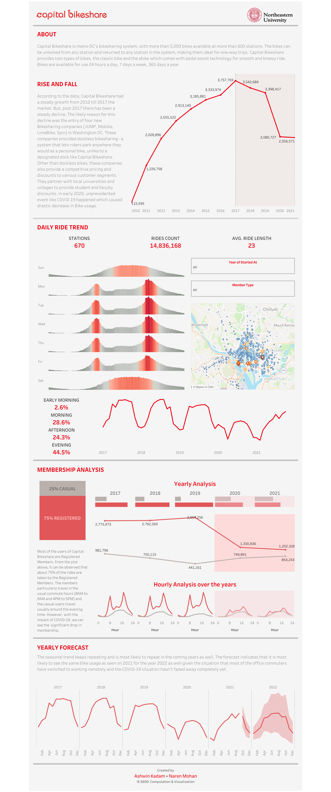

# Analysis-on-Capital-Bikeshare-data

Capital Bikeshare is metro DC's bikesharing system, with more than 5,000 bikes available at more than 600 stations. The bikes can be unlocked from any station and returned to any station in the system, making them ideal for one-way trips. Capital Bikeshare provides two types of bikes, the classic bike and the ebike which comes with pedal assist technology for smooth and breezy ride. Bikes are available for use 24 hours a day, 7 days a week, 365 days a year. 

This dashboard intends to cover the story of the rise of Capital Bikeshare in the bikeshare market at Washington D.C. and the impact of the rise in the number of  competitors and COVID-19 using Tableau. 

The following link is the dashboard that was created to cover this story - 
https://public.tableau.com/app/profile/naren.mohan/viz/AnalysisonCapitalBikeshareData/CapitalBikeshare

The dataset used here can be found at -  
https://www.capitalbikeshare.com/system-data  
https://archive.ics.uci.edu/ml/datasets/bike+sharing+dataset  

The data from 2010 to 2021 November (72 CSV files) were collected, preprocessed, stacked into one single CSV file and then used as a data source to create the Tableau dashboard. 

The design of this dashboard was inspired from the following dashboard created by Zainab Ayodimeji - 
https://public.tableau.com/app/profile/zainab2225/viz/SunnyStreetVizForSocialGood_16318182787050/SUNNYSTREETVFSG

This dashboard was created by myself [Naren Mohan](https://www.linkedin.com/in/narenmohan1997/) and my teammate [Ashwin Kadam](https://www.linkedin.com/in/ashwinkadam07/) as part of the IE6600 Computation & Visualization course under Professor Mohammadi Ramin in Northeastern University.
